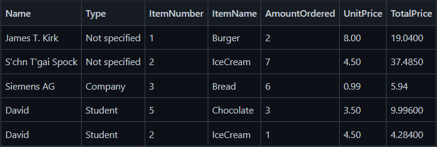

Simple-Shop-App
===============

> A simple invoice maker with tax calculation written in C#.

## General Info
As a business owner you probably often have to prepare invoices with the help of billing machines.
This simple shop software is developed for generating invoices with tax calculation based on orders in TAG format (See [SampleOrder.tag](./SimpleShop.Test/SampleOrder.tag)).
The tag file contains information such as **ItemNumber**, **ItemName**, **CustomerName**, **CustomerType**, **AmountOrdered**, **UnitPrice**.
To print invoices for each customer, you need a basis for all your pricing calculations. The value added tax (VAT) rate of 19%, for example, is applied to all customer types (if applicable) except for companies.
Also, for students, 20% discount will be applied before VAT.
By running the program, it will output an invoice with a summary for each customer and write data into a CSV file (See [myfile.csv](./myfile.csv)).   

<p align="center">
   
</p>

<p align="center">
   
</p>

## Setup
1. Clone this project to your local machine: `git clone https://github.com/hmhuang0501/Simple-Shop-Project.git`
2. Open **SimpleShop.sln**
3. Open "Package Manager Console" in Visual Studio
   > To open the console in Visual Studio, go to the main menu and select Tools > NuGet Package Manager > Package Manager Console command
4. Run the following command to install [CsvHelper](https://github.com/JoshClose/CsvHelper) package:
   ```
   PM> Install-Package CsvHelper
   ```
   
## How To Use
**Method 1:**
> Change directory to Simple-Shop-Project\SimpleShop\bin\Debug\netcoreapp3.1, then pass the tag file as the command-line argument with the command: ```SimpleShop ../../../../SampleOrder.tag```  

**Method 2:**
> Debugging with command-line arguments within Visual Studio (See [here](https://dailydotnettips.com/how-to-pass-command-line-arguments-using-visual-studio/) for detailed steps)
