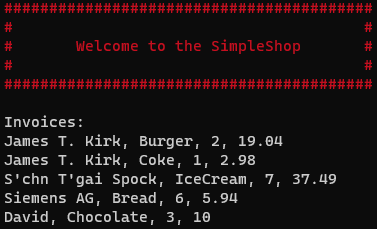

## Introduction
As a business owner you probably often have to prepare invoices with the help of billing machines.
This simple shop software is developed for generating invoices with tax calculation based on orders in TAG format (See [SampleOrder.tag](./SimpleShop.Test/SampleOrder.tag)).
The tag file contains information such as ItemNumber, ItemName, CustomerName, CustomerType, AmountOrdered, NetPrice.
To print invoices for each customer, you need a basis for all your pricing calculations. The value added tax (VAT) rate of 19%, for example, is applied to all customer types (if applicable) except for companies.
Also, for students, 20% discount will be apllied before VAT.
By running the program, it will output an invoice with a summary for each customer.   



## How to use the code?
> **Method 1:** Change directory to Simple-Shop-Project\SimpleShop\bin\Debug\netcoreapp3.1, then pass the tag file as the command-line argument with the command: ```SimpleShop SampleOrder.tag```  
> 
> **Method 2:** Debugging with command-line arguments within Visual Studio (See [here](https://dailydotnettips.com/how-to-pass-command-line-arguments-using-visual-studio/) for detailed steps)
  
